## 1.项目简介

### 1.1 基本介绍

- 本项目是基于POI框架编写的Excel数据填充工具；
- 基于模板填充数据，操作简单，容易理解，容易上手。


### 1.2 特点与亮点

> 这节看不懂🤣？没关系🤣，其实我也看不懂，哈哈。
>
> 直接看第3节即可。🤣


- 模板填充

  只需要在模板中定义表达式，再将数据传给框架，框架会根据表达式的内容与模板公式自动填充数据。

  您的模板可以来自任何地方，如：文件服务器、oss、本地文件等等。本框架并不关心您的模板从哪里获取。

  您的数据也可以来自任何地方，如：远程调用获取、数据库获取、本地计算产生等。本框架同样不关心您的数据从何种地方获取。

  您只需要提供**sheet**和**数据**即可。


- 模板表达式丰富

  模板中的表达式支持对数据的 **加减乘除，三目运算**操作，支持**自定义函数**操作(在构建引擎时加入自定义的函数，即可再模板中进行指向，程序会**自动调用**)。实现了数据的多变性，实现了数据与模板的解耦。


- 支持简单、**数组**、**树形结构**的填充


- 支持扩展

  如果框架提供的标签不够满足您的使用要求，您还可以进行扩展，而不用更改任何代码。


## 2. 基本功能演示


### 2.1 基本类型填充

- 数据（card可以**是map**，也可以**是对象**，为了方便展示，所以转换为了Json）

  ```json
  {
      "card":{
          "company":"家里蹲",
          "email":"zyliu99@foxmail.com",
          "name":"远子哥",
          "phoneNumber":"111000111"
      }
  }
  ```


- 模板

  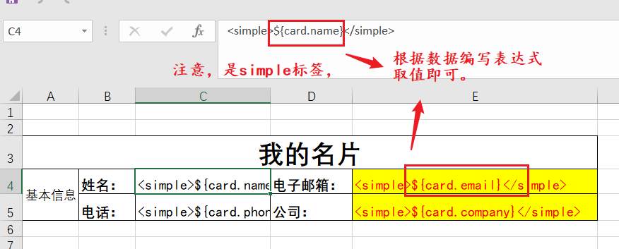

- 结果(可想而知)

  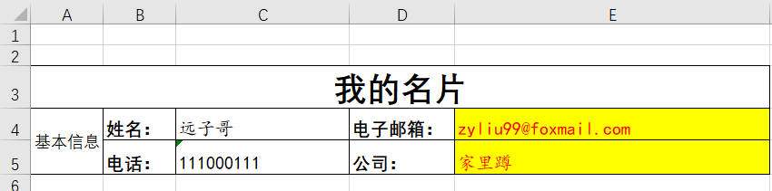


### 2.2 数组类型填充

- 数据（card可以**是map**，也可以**是对象**，为了方便展示，所以转换为了Json）

  ```json
  {
      "classScore":{
          "level":"五年级一班",
          "name":"清华xx附属小学",
          "phone":"15032000000",
          "score":[
              {
                  "chinese":80,
                  "english":30,
                  "math":98,
                  "name":"张三"
              },
              {
                  "chinese":70,
                  "english":88,
                  "math":88,
                  "name":"李四"
              },
              {
                  "chinese":90,
                  "english":90,
                  "math":61,
                  "name":"王五"
              },
              {
                  "chinese":86,
                  "english":78,
                  "math":78,
                  "name":"赵六"
              }
          ]
      }
  }
  ```


- 模板

  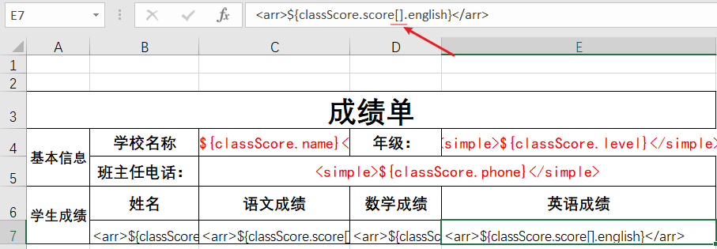

- 结果(可想而知)

  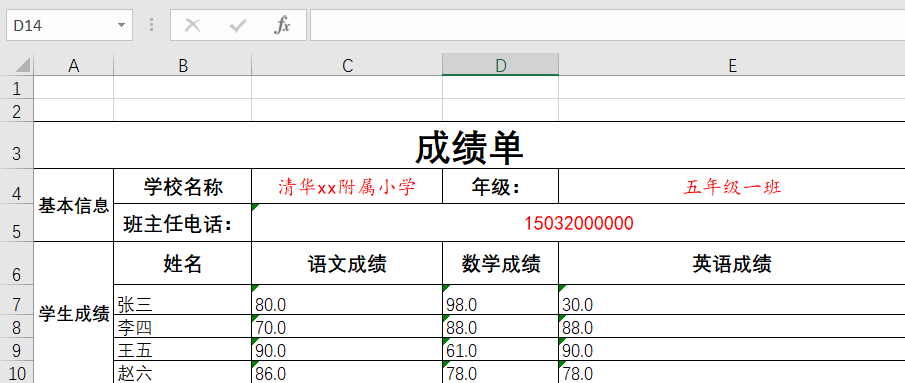


### 2.3 树形结构填充

所谓树形结构，就是上下一样的合并起来，效果就像是一个横着的树。

- 数据（card可以**是map**，也可以**是对象**，为了方便展示，所以转换为了Json）

  ```json
  {
      "contractInfo":{
          "contactName":"liuzy",
          "contactTel":"15020000000"
      },
      "peopleInfo":[
          {
              "cityName":"石家庄市",
              "peopleName":"张三",
              "provinceName":"河北省",
              "villageName":"兼顾村"
          },
          {
              "cityName":"石家庄市",
              "peopleName":"张三",
              "provinceName":"河北省",
              "villageName":"兼顾村"
          },
          {
              "cityName":"保定市",
              "peopleName":"李四2",
              "provinceName":"河北省",
              "villageName":"牛村"
          },
          {
              "cityName":"保定市",
              "peopleName":"李四3",
              "provinceName":"河北省",
              "villageName":"牛村"
          },
          {
              "cityName":"海淀区",
              "peopleName":"风",
              "provinceName":"北京市",
              "villageName":"厉害村"
          },
          {
              "cityName":"朝阳区",
              "peopleName":"扽给",
              "provinceName":"北京市",
              "villageName":"牛逼村"
          }
      ]
  }
  ```


- 模板

  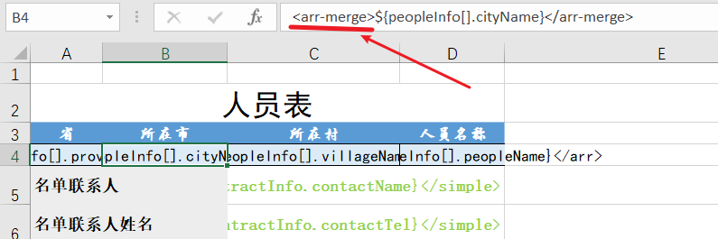

- 结果

  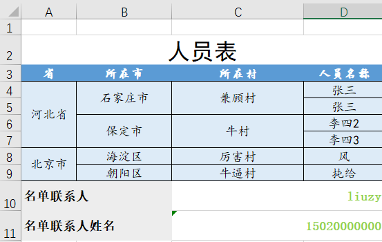


### 2.4 表达式计算

在模板中除了支持普通的变量声明之外，还支持各种基本的运算。

比如加减乘除，三目运算等等一些基本的运算。

下面我们以上述 **分数的案例**的基础上使**用三目运算符来进行举例。**

具体需求为：

- 当分数大于等于60时我们显示及格
- 当分数小于60时我们显示不及格

在数据不变的情况下，我们改变模板，在表达式中使用三目运算符....

模板如下：

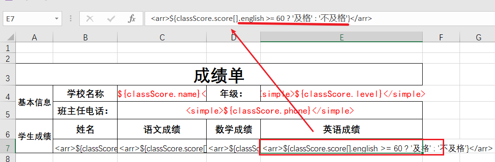

同样数据的填充结果如下：

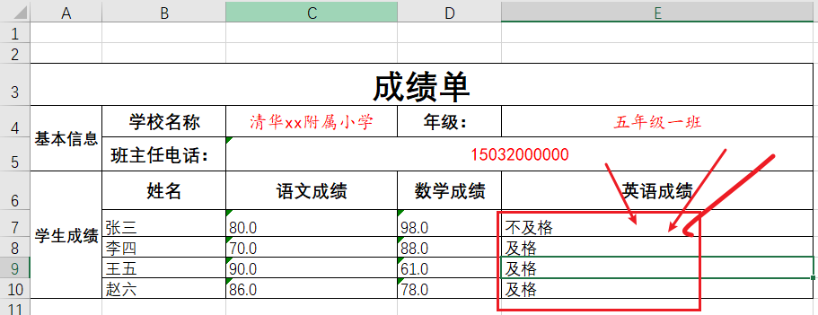


### 2.5 自定义函数

有时候，可能单一的、简单的运算并不能满足我们，此时我们可以自定义我们自己的函数来对填充的变量做一下复杂的处理。

需求如下：当分数：

- \>= 90 显示优秀
- \>= 80 显示良好
- \>= 60 显示尚可
- 其他情况，显示不及格

下面我们就演示一下使用如何利用自定义函数来实现这个功能：

1. 编写自定义函数

   ```java
   /**
    * @author immort-liuzyj(zyliu)
    * @since 2022/7/12  9:20
    */
   public class ScoreUtil {
   
       /**
        * 分数格式化方法
        *
        * @param score 分数
        * @return 格式化后的结果
        */
       public static String formatScore(double score) {
   
           String evaluation;
   
           if (score >= 90) {
               evaluation = "优秀";
           } else if (score >= 80) {
               evaluation = "良好";
           } else if (score >= 60) {
               evaluation = "尚可";
           } else {
               evaluation = "不及格";
           }
           return evaluation;
       }
   }
   ```

2. 注册全局函数

   **实现函数提供者**

   ```java
   /**
    * @author immort-liuzyj(zyliu)
    * @since 2022/7/11  17:52
    * 函数提供者
    */
   public class MyFunctionProvider3 implements FunctionProvider {
   
   
       /**
        * 提供function
        *
        */
       @Override
       public Map<String, Object> provideFunctions() {
           Map<String, Object> res = new HashMap<>();
           res.put("Lists", Lists.class);
           // 注册到全局
           res.put("ScoreUtil", ScoreUtil.class);
           return res;
       }
   }
   ```

   **使用SPI机制注册：**

   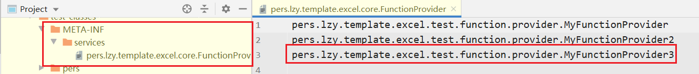

3. 在模板中使用函数

   使用函数时的格式为：**注册的名称 + 冒号 + 静态方法名称**

   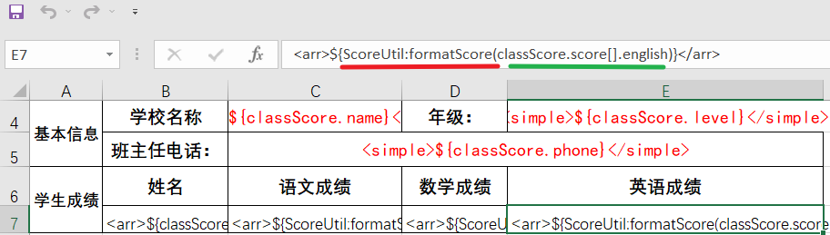


导出结果如下：

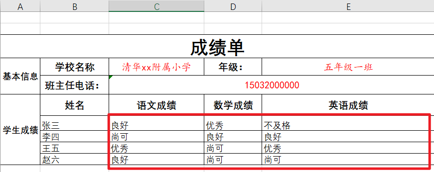


## 3. 项目详细使用


### 3.1 代码演示

#### 3.1.1 创建“填充者”


#### 3.1.2 准备数据与模板


#### 3.1.3 使用“填充者”对象填充Excel

### 3.2 Spring-Boot 整合


### 3.3 Spring整合


## 4. 项目扩展

> 采用SPI机制进行扩展

### 4.1 扩展处理单元格的handler


#### 4.1.1 继承抽象类/实现接口  

>下面会有两种方案，您可自由选择。下面不会有过多的赘述，您直接看方法的注释即可明白。

##### 4.1.1.1 抽象类

抽象类是对接口的抽象。很明显，使用抽象类扩展，您可以注重您的逻辑，而不用关心一些细枝末节的东西。因为Excel的单元格解析、内容抽取已经在抽象类中做了，您只需要继承抽象类去完成剩余的方法即可。


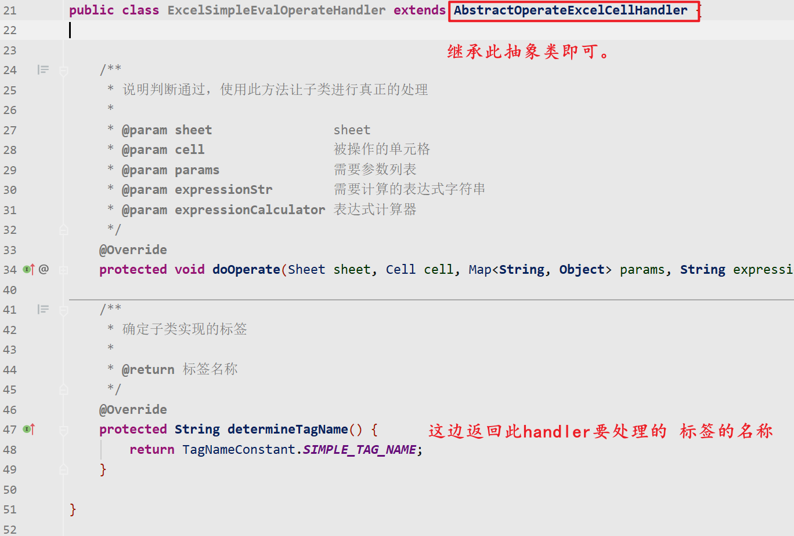


##### 4.1.1.2 接口

使用接口扩展，您可以从Excel单元格内容解析开始做，可自己处理的东西变多。

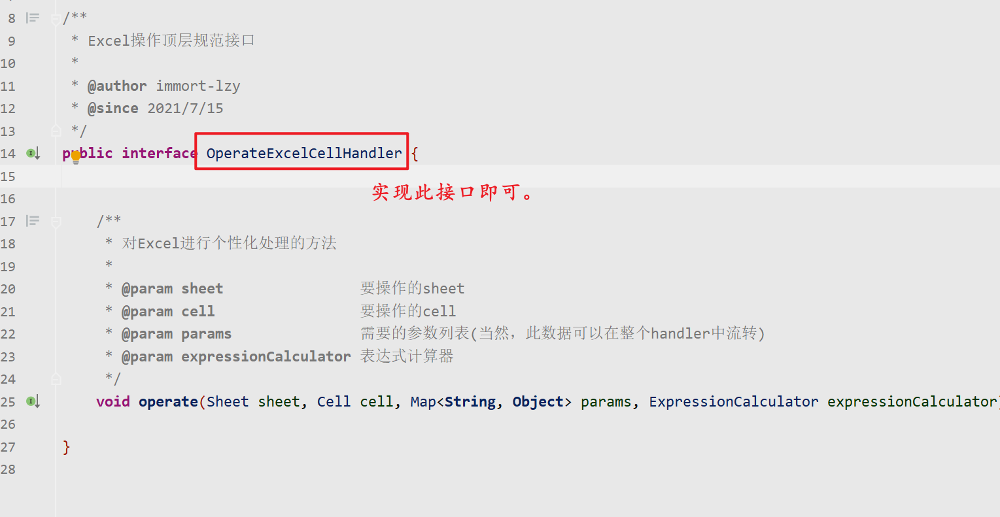

#### 4.1.1 SPI机制声明

- **在classpath下创建如下文件：**

  

- **在文件中将自己扩展的类 的全限定类名放入文件中**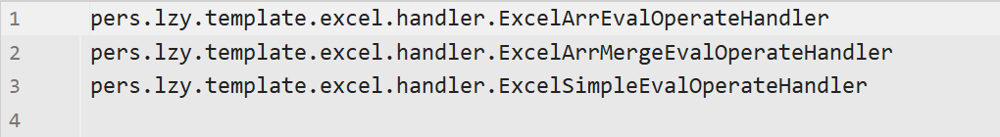


### 4.2 扩展填充完成之后的处理器

- 实现此接口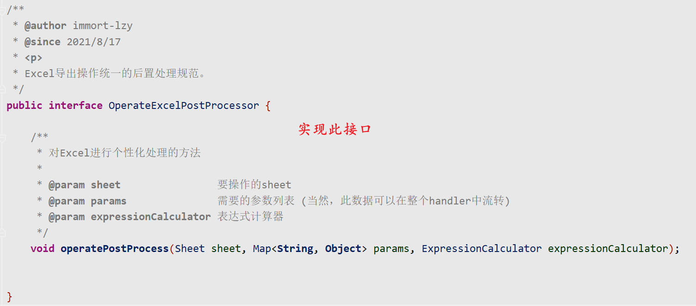

- 使用SPI机制声明

  这里参考上面即可。


### 4.3 注册全局函数

- 实现下面的接口

  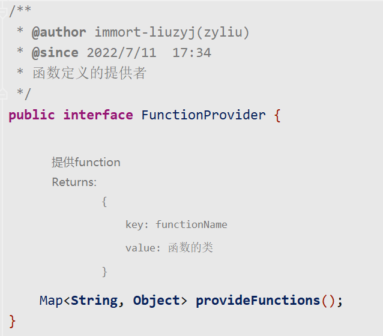

  示例如下:

  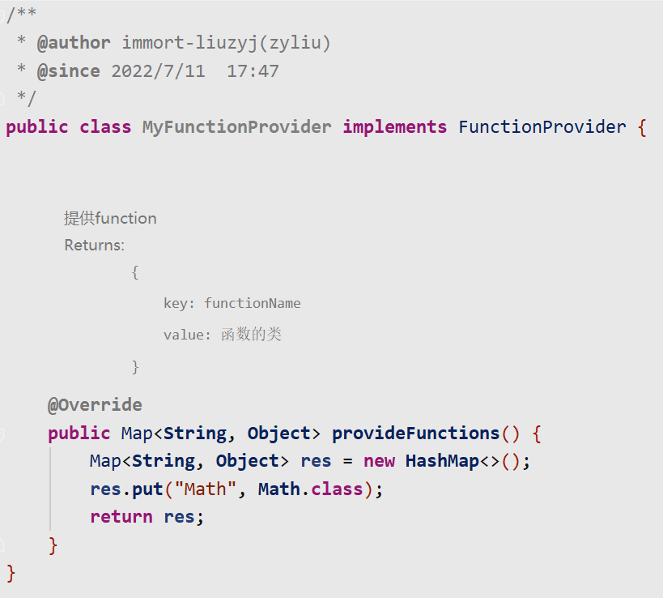

- 使用SPI机制声明即可

  在classpath下新建文件`/META-INF/services/pers.lzy.template.excel.core.FunctionProvider`，并在文件下填充对应类的全限定类名即可。

  

  ​


## 5. 联系我
- `email`:  **zyliu99@foxmail.com**


## 6. 开源协议


